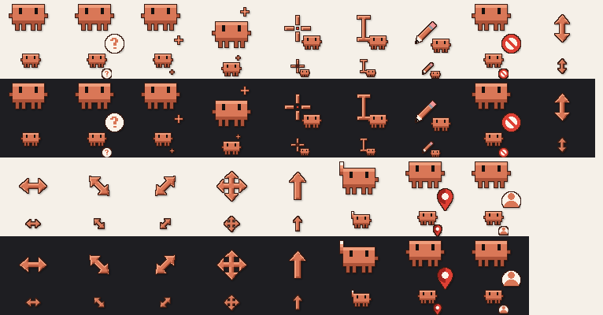

# Clawd Cursors

Esquema completo de cursores do Windows com o Clawd, o pet em pixel art do Claude Code.



São 17 cursores (normal, ajuda, texto, link, ocupado animado, redimensionar, etc.) em 32, 64 e 128 px.

## Instalar

1. Baixe o `Clawd.zip` na página de [Releases](../../releases) e extraia.
2. Clique com o botão direito no `Install.inf` e escolha **Instalar** (no Windows 11 pode estar em **Mostrar mais opções**).
3. `Win+R` → `main.cpl` → aba **Ponteiros** → escolha o esquema **Clawd** → **Aplicar**.

## Gerar de novo

```bash
pip install pillow
python make_cursor.py
```

Gera a pasta `Clawd/`, o `Clawd.zip` e o `preview.png`.

---

Projeto de fã, sem relação com a Anthropic. Claude e Clawd são da Anthropic.
